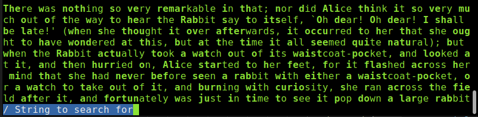

# less_fp - Simple less with fixation points.
In principle it's is supposed to help you read a little bit faster.

## Description 
This simple program reads a text file, paginate's and shows it with fixation points in bold. In principal they are supposed to allow you to read faster. <br>
Use **Esc** to quit. <br>
Use '**q**' to prev_page. <br>
Use '**a**' to next_page. <br>
Use '**/**' to search for a string. <br>
Use '**/**' to search + **Enter** key to exit search mode. <br>
Use '**p**' to prev found string. <br>
Use '**n**' to next found string. <br>
Use mouse or keyboard for terminal resize. <br>
I tested it under **Linux** maybe it works under **Windows**. <br>
This is a nostalgia project, so that I could remember the Sintra green terminals that emulated VT100 terminals, in my first years of college :-)

## Screenshots
**Help screen** <br>
<br>

 <br>


**Output screen** <br>


 <br>


You can press '**a**' to go to the next page or '**q**' to go to the previous page. <br>
You can **make a search for a string**, by pressing in '**/**' and entering the search string. <br>
<br>


 <br>


You can press '**n**' to go to the next founded word or '**p**' to go to the previous founded word. <br>
You can **make a search for a string**, by pressing in '**/**' and  press **Enter** to **exit search mode**. Or enter a new search string. The **current search string will be in bold**.<br>
<br>


 <br>


## Dependencies
```
clap = "3.1.18"
unic-normal = "0.9.0"
crossterm = "0.23.2"
```


## References
* Bionic Reading <br>
  [https://bionic-reading.com/](https://bionic-reading.com/)

* Understanding The Concept Of Eye Fixation <br>
  [https://www.speedreadinglounge.com/eye-fixation](https://www.speedreadinglounge.com/eye-fixation)


## License 
MIT Open Source license.


## Have fun!
Best regards, <br>
João Nuno Carvalho
